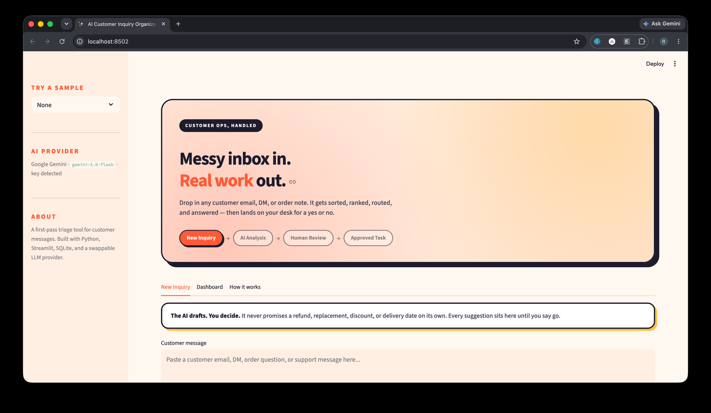
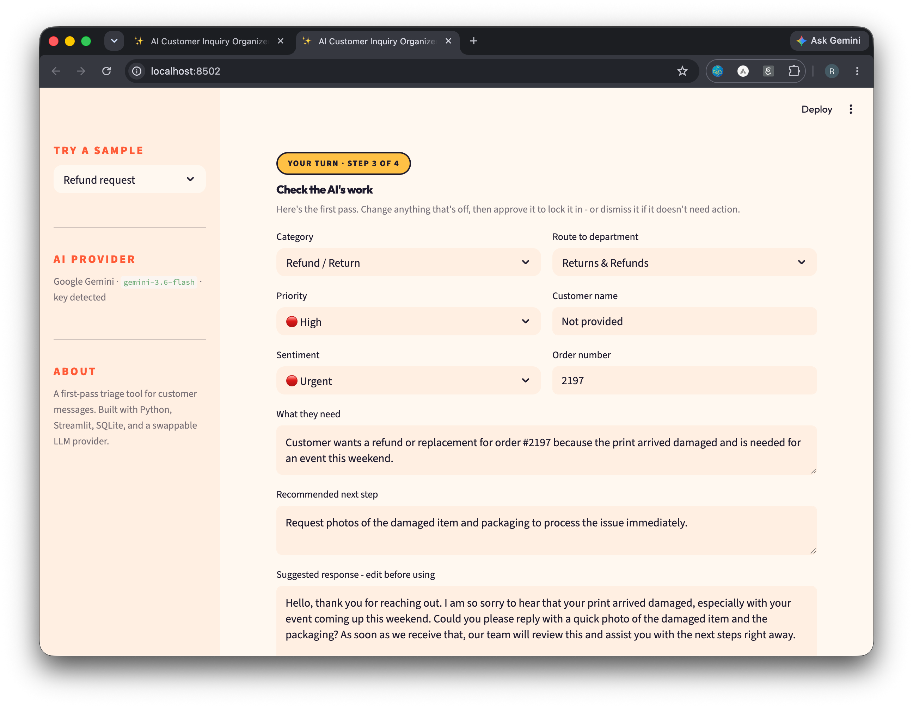
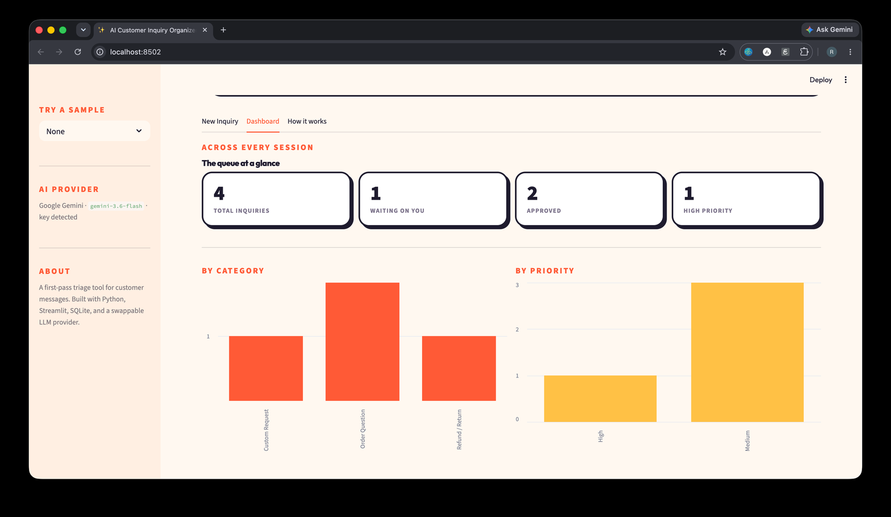
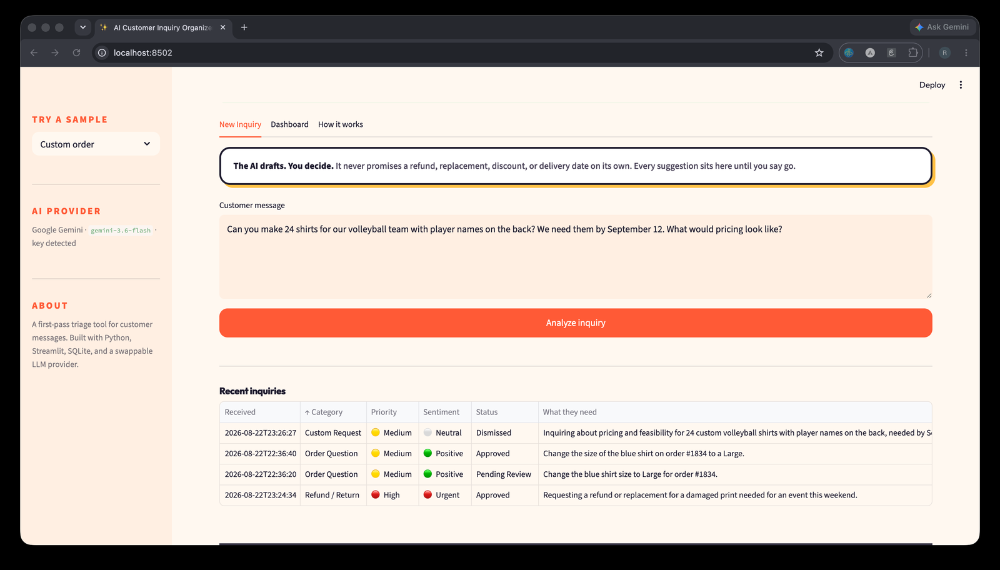

# AI Customer Inquiry Organizer

Turns unstructured customer messages into structured, reviewable support tasks — with a human approving every result before it counts.

Built by **Rachel Beecham** · [GitHub](#) · [LinkedIn](#)

<!-- Replace the (#) placeholders above with your real profile URLs. -->

---

## Screenshots

<!--
Take these four and drop them in a screenshots/ folder, then update the paths.
See "Screenshots to take" at the bottom of this file for exactly what to capture.
-->

| The app | Human review |
|---|---|
|  |  |

| Dashboard | Recent inquiries |
|---|---|
|  |  |

---

## The problem

Customer messages arrive messy. Different wording, different tone, different amount of detail every time:

> Hey! I ordered the blue shirt last week and I think I picked the wrong size. Can I change it to a large? Order #1834. Thanks!

Before any actual work happens, a person has to read it, work out what the customer needs, judge how urgent it is, figure out who should handle it, and draft a reply. Multiply that by an inbox and it's a real operational cost — and it's the kind of repetitive first-pass triage that gets slower and less consistent the busier things get.

## What this does

The app performs that first pass and produces a structured task:

| Field | Example |
|---|---|
| Category | Order Change |
| Priority | Medium |
| Sentiment | Neutral |
| Customer name | Not provided |
| Order number | 1834 |
| What they need | Change shirt size to Large |
| Recommended next step | Confirm whether the order can still be changed |
| Route to | Order Fulfillment |
| Suggested response | A warm, professional draft reply |

Every field is editable. Nothing is final until a person clicks **Approve**.

## The workflow

```
New Inquiry  →  AI Analysis  →  Human Review  →  Approved Task
```

The human review step is the point of the project, not an afterthought. The AI is explicitly instructed never to promise a refund, replacement, discount, delivery date, or policy exception — those are business decisions, not classification tasks. It drafts; a person decides.

---

## Features

- **Structured extraction** — category, priority, sentiment, customer name, order number, request summary, next step, department routing, and a draft reply
- **Human review workflow** — every AI result is editable before approval, with approve and dismiss actions
- **Validated output** — the AI's answer is checked against approved values; anything unrecognized falls back to a safe default rather than being displayed as-is
- **Local persistence** — every inquiry is saved to SQLite with a status, so history survives restarts
- **Dashboard** — running totals by category, priority, and status across all sessions
- **Swappable AI provider** — runs on Google Gemini by default, switches to OpenAI with one environment variable
- **Graceful failures** — out-of-credit, bad-key, rate-limit, and retired-model errors each produce a specific, actionable message instead of a stack trace
- **JSON export** — download any task as structured data

---

## Tech stack

| Layer | Choice | Why |
|---|---|---|
| Language | Python | Fits the task; readable |
| Interface | Streamlit | Full UI without a separate frontend build |
| Storage | SQLite | Single file, no server to run, real SQL |
| AI | Gemini / OpenAI | Swappable via an OpenAI-compatible endpoint |
| Config | Environment variables | Keeps API keys out of the repository |

---

## Architecture

Five files, each with one job:

```
app.py         Interface and the review workflow
ai.py          Provider selection, the prompt, and validation of the response
db.py          SQLite storage: save, update, and query inquiries
constants.py   Approved categories, priorities, sentiments, departments
styles.py      The visual design layer
```

**Why it's split this way.** The starter version was a single file where the UI, the prompt, and the parsing were interleaved. Separating them means the interface doesn't need to know anything about prompts, and the AI code doesn't need to know anything about Streamlit — `ai.py` and `db.py` can both be tested without launching the app.

**Two decisions worth calling out:**

*The AI's output is never trusted directly.* A language model can return a category that doesn't exist, a misspelled priority, or a field that's simply missing. `validate_result()` checks every constrained field against the approved list in `constants.py` and substitutes a safe default when something doesn't match. The human reviewer then corrects it. Validating at the boundary — rather than assuming the model behaves — is what keeps a bad response from becoming a bad record.

*The provider is configuration, not code.* Google's Gemini API accepts requests in the same shape OpenAI's does, so the same client library talks to either one. `ai.py` holds a `PROVIDERS` dictionary and reads `AI_PROVIDER` from the environment. Swapping models is a config change, not a rewrite.

---

## Run it locally

**1. Clone and enter the project**

```bash
git clone https://github.com/YOUR-USERNAME/ai-customer-inquiry-organizer.git
cd ai-customer-inquiry-organizer
```

**2. Create a virtual environment**

macOS / Linux:

```bash
python3 -m venv .venv
source .venv/bin/activate
```

Windows:

```powershell
python -m venv .venv
.venv\Scripts\activate
```

**3. Install dependencies**

```bash
pip install -r requirements.txt
```

**4. Set an API key**

The app uses Google Gemini by default — the free tier requires no credit card. Create a key at [aistudio.google.com/apikey](https://aistudio.google.com/apikey).

macOS / Linux:

```bash
export GEMINI_API_KEY="your_key_here"
```

Windows PowerShell:

```powershell
$env:GEMINI_API_KEY="your_key_here"
```

To use OpenAI instead:

```bash
export AI_PROVIDER=openai
export OPENAI_API_KEY="your_key_here"
```

**5. Start the app**

```bash
streamlit run app.py
```

It opens at `http://localhost:8501`. The sidebar shows which provider is active and whether it found your key.

> **Never commit a real API key.** `.gitignore` excludes `.env` and `.streamlit/secrets.toml` for this reason. If a key is ever exposed, revoke it and issue a new one.

---

## Roadmap

- [ ] Automated tests for JSON parsing, validation, and the database layer
- [ ] Filter and search the inquiry history
- [ ] Bulk import from a CSV of messages
- [ ] Response templates per category
- [ ] Track how often a human changes the AI's answer — a direct accuracy measure
- [ ] Deploy a public demo with a read-only sample dataset

---

## Screenshots to take

1. **Home** — the hero, empty message box, workflow stages
2. **Review** — a completed analysis with the editable fields visible
3. **Dashboard** — stat cards and charts, after analyzing several inquiries
4. **History** — the recent inquiries table with a mix of statuses

Use the sample inquiries in the sidebar so the screenshots show realistic content.
